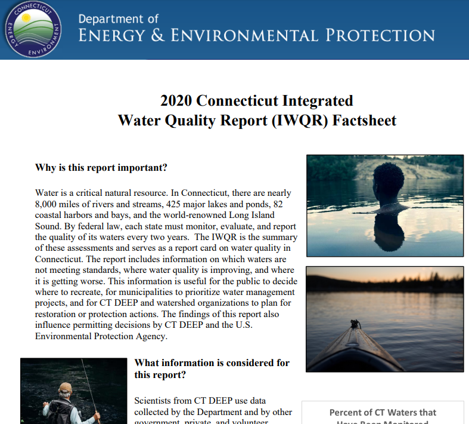
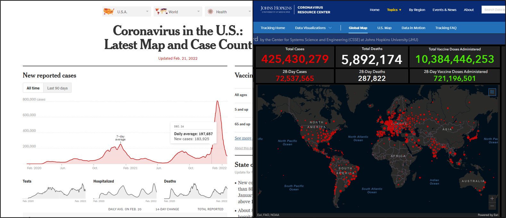
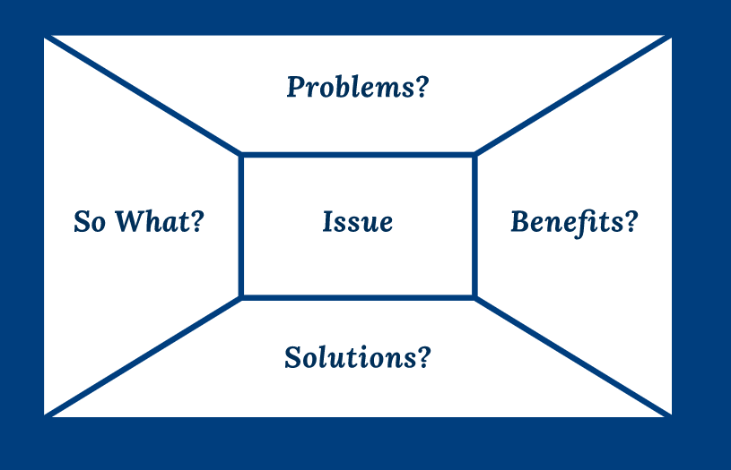
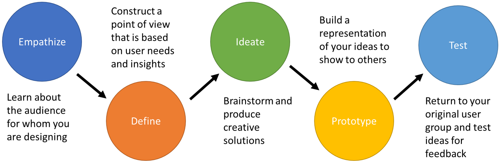
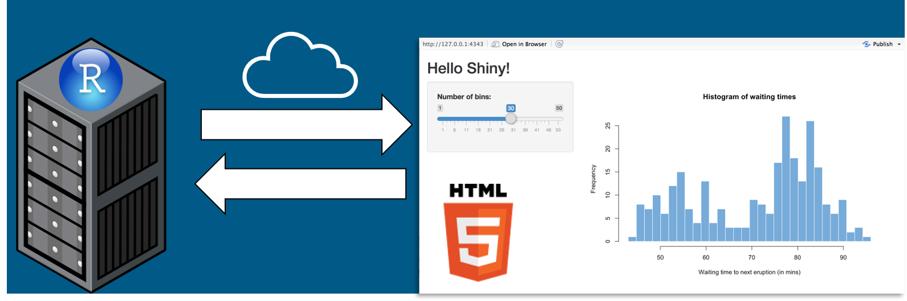
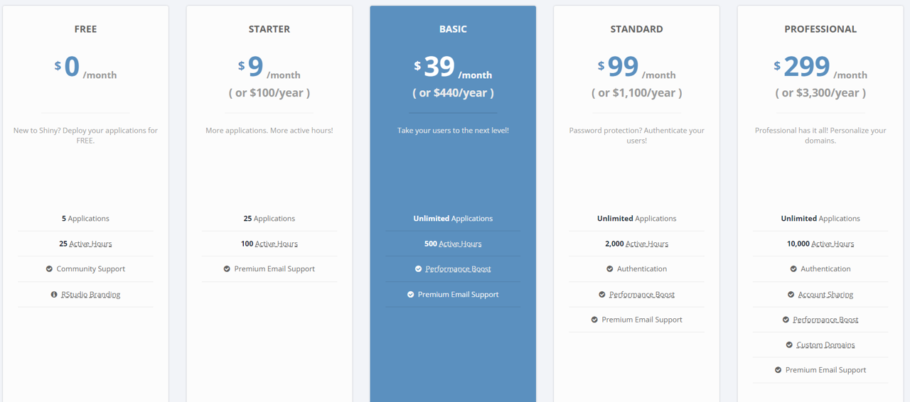
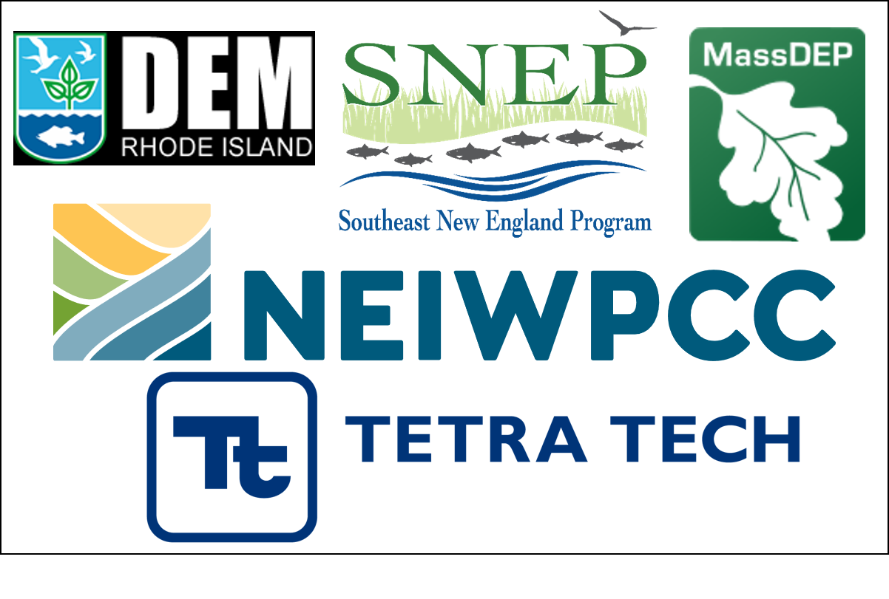

```{r global_options, include=FALSE}
knitr::opts_chunk$set(warning=FALSE)
```

# Content 

1. Engaging constituents is important
2. Documents need to be digestible
3. Many orgs use science communication tools
4. User design should be considered
    <!-- + Main Libraries -->
5. R Shiny can achieve these goals
6. Case study: This app!
7. Other considerations
8. Conclusions
9. References and Resources


## 1. Engaging constituents is important

>Informed and Involved Public Goal: Basin residents and visitors will understand and appreciate Lake Champlain Basin resources, and will possess a sense of personal responsibility that results in behavioral changes and actions to reduce pollution. ~ Lake Champlain Basin Program Opportunities for Action.

* <font size= "5">Ensure residents and visitors understand and appreciate natural resources</font>
* <font size= "5">Encourage a sense of personal responsibility and stewardship</font>
* <font size= "5">Inform civic leaders and policy makers on important issues</font>
* <font size= "5">Improve communication, science literacy, equity, and inclusion</font>

&nbsp;
&nbsp;
&nbsp;

## 2. Documents need to be digestible

* <font size= "5">Formal documents, required by the federal government, are necessary</font>
* <font size= "5">Not everyone has time to read formal documents front to back</font>
* <font size= "5">Integrated Report length by state (not including appendices):</font>

```{r error = F, warning = F, message = F, echo=FALSE}
library(dplyr)
library(knitr)
library(kableExtra)

States <- c("Connecticut", "Maine", "Massachusetts", "New Hampshire"
            , "New York", "Rhode Island", "Vermont")
pg_len <- c(62, 212, 225, 119, 91, 56, 52)

table1 <- as.data.frame(cbind(States, pg_len))

table1 <- table1 %>% 
  rename(State = States, `Report Length (Pages)` = pg_len)

table1 %>%
  kable() %>%
  kable_styling(full_width = F, position = "center")

```

&nbsp;

* <font size= "5">[CT DEEP 2020 IWQR Factsheet](https://portal.ct.gov/-/media/DEEP/water/water_quality_management/305b/2020/IWQR2020Factsheet.pdf) is great! Could be dynamic!</font>



&nbsp;
&nbsp;
&nbsp;
&nbsp;


## 3. Many orgs use science communication tools

* <font size= "5">Puts information at the fingertips of stakeholders, public, and policy makers</font>
* <font size= "5">Examples include John Hopkins and NY Times COVID-19 resources</font>



&nbsp;
&nbsp;
&nbsp;
&nbsp;

## 4. User design should be considered

* <font size= "5">Content should be considered</font>



* <font size= "5">But content must also be effectively delivered</font>



&nbsp;
&nbsp;
&nbsp;
&nbsp;

## 5. R Shiny can achieve these goals

* <font size= "5">R Shiny is a framework for creating web apps using R code</font>
* <font size= "5">Does not require knowledge of HTML, CSS, or JavaScript</font>
* <font size= "5">Every Shiny app is maintained by a computer or server running R</font>



* <font size= "5">Can range from ultra-basic to completely customized</font>
   + <font size= "5">https://shiny.rstudio.com/gallery/</font>
   + <font size= "5">Simple option to use styling options include shinythemes and bslib packages</font>
* <font size= "5">Can be enhanced by CSS and HTML coding experience</font>
* <font size= "5">Hosted on shinyapps.io – accessible by anyone with internet connection</font>
   + <font size= "5">Free or reasonably priced</font>
    


&nbsp;
&nbsp;
&nbsp;
&nbsp;

## 6. Case study: This app!

&nbsp;
&nbsp;
&nbsp;
&nbsp;

## 7. Other considerations

* <font size= "5">Options to make data publicly accessible - via GitHub</font>
* <font size= "5">Hosting R Shiny apps on your website</font>
* <font size= "5">Consider adding other media forms</font>
* <font size= "5">Share via social media</font>
* <font size= "5">Tetra Tech has broad experience making technical and non-technical content</font>

## 8. Conclusions
* <font size= "5">R Shiny is an excellent platform to create custom interactive outreach materials</font>
* <font size= "5">Formal documents are well suited for the government but not the public</font>
* <font size= "5">Science communication should be considered in every project</font>
    + <font size= "5">Maximize impact by including sci comm in all future projects</font>
* <font size= "5">**Public outreach should be a priority**</font>

## 9. References and Resources
* <font size= "5">Shiny Tutorials (https://shiny.rstudio.com/tutorial/)</font>
* <font size= "5">Markdown Tutorials (https://rmarkdown.rstudio.com/lesson-1.html)</font>
* <font size= "5">Shiny Gallery of Ideas (https://shiny.rstudio.com/gallery/)</font>
* <font size= "5">Markdown Gallery of Ideas (https://rmarkdown.rstudio.com/gallery.html)</font>
* <font size= "5">Mastering Shiny eBook (https://mastering-shiny.org/)</font>
* <font size= "5">Datacamp Self-Paced Tutorials (https://datacamp.com)</font>

